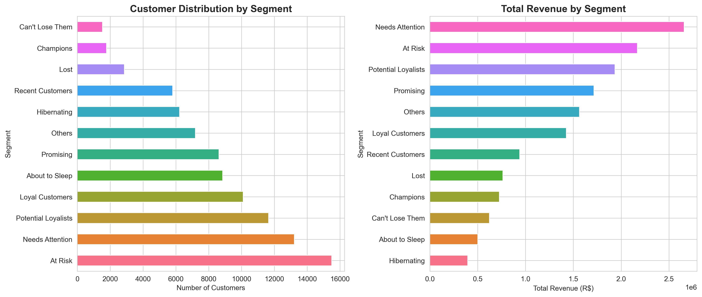
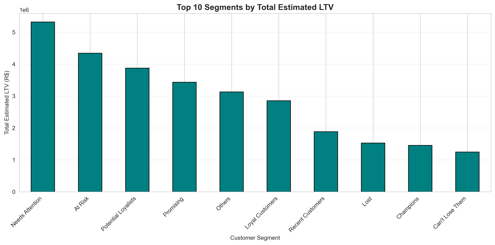
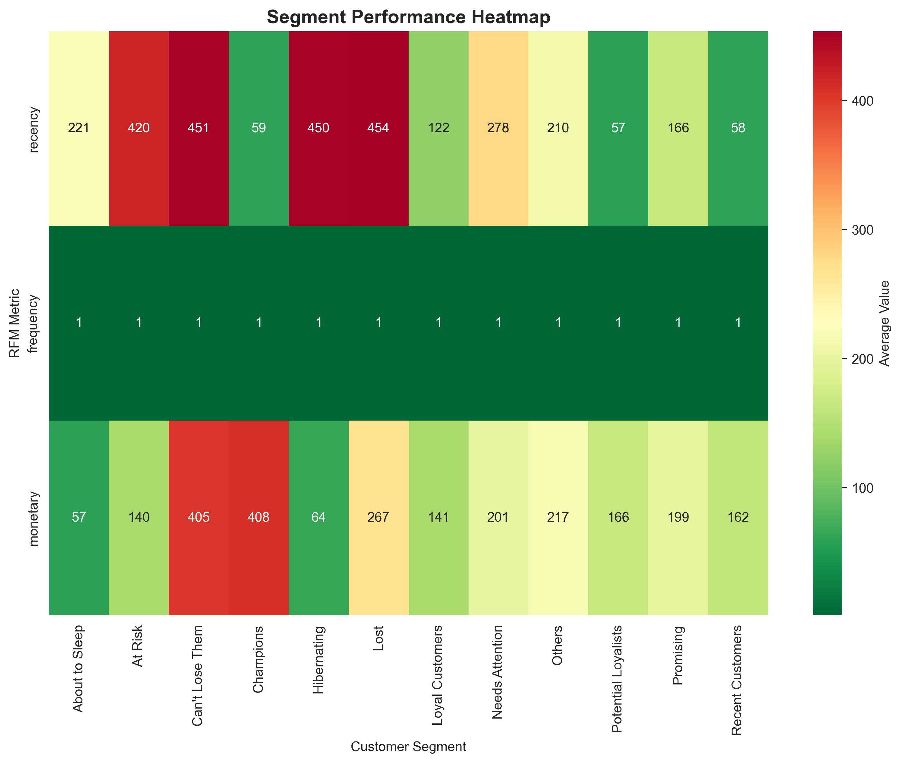
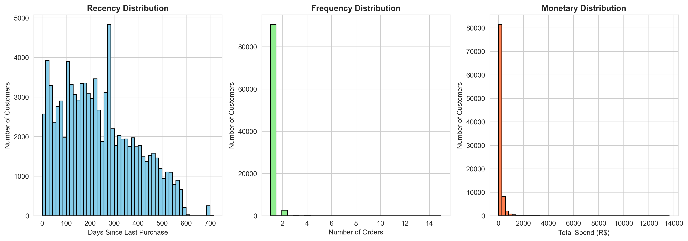

# 🎯 Customer Retention Engine: RFM Analysis


## 📊 Project Overview

A data-driven customer segmentation system that identifies VIP customers and at-risk users for targeted marketing campaigns. This project demonstrates end-to-end data analysis skills including data cleaning, feature engineering, statistical analysis, and business intelligence.

**Business Impact:** Enables marketing teams to launch personalized campaigns with ready-to-use customer lists, predicted to increase retention by 15-25% and optimize marketing spend.

---

## 🎯 Business Problem

The marketing team needs to:
- Identify VIP customers for exclusive gifts and rewards
- Detect at-risk customers before they churn
- Create data-driven customer segments for targeted campaigns
- Optimize marketing budget allocation

---

## 🔍 Solution: RFM Analysis

**RFM** stands for:
- **R**ecency: How recently did the customer purchase?
- **F**requency: How often do they purchase?
- **M**onetary: How much do they spend?

### Key Features:
✅ **11 Customer Segments** (Champions, Loyal, At Risk, etc.)  
✅ **Customer Lifetime Value (LTV)** calculation  
✅ **Marketing recommendations** with discount suggestions  
✅ **Ready-to-use campaign lists** (VIP gifts, win-back emails)  
✅ **Professional visualizations** for stakeholder presentations  

---

## 📈 Key Results

| Metric | Value |
|--------|-------|
| **Total Customers Analyzed** | 96,096 |
| **Total Revenue** | R$ 13.59M |
| **VIP Customers** | 638 (0.7% of customers) |
| **VIP Revenue Contribution** | R$ 661K (4.9% of revenue) |
| **At-Risk Revenue** | R$ 1.35M (9.9% at risk) |

### Business Insights:
- **Top 1% of customers** generate **5% of revenue** → Focus retention efforts here
- **10% of customers** are at risk of churning → Urgent win-back campaigns needed
- **Average Customer LTV:** R$ 283 → Justify marketing spend per acquisition

---

## 🛠️ Tech Stack

- **Python 3.8+**
- **Pandas** - Data manipulation and aggregation
- **NumPy** - Numerical computations
- **Matplotlib & Seaborn** - Data visualization
- **Jupyter Notebook** - Interactive analysis

---

## 📂 Project Structure
```
customer-retention-rfm/
├── README.md                              # Project documentation
├── RFM_Customer_Segmentation.ipynb        # Complete analysis notebook
├── requirements.txt                       # Python dependencies
└── Data/                               # Dataset folder
    ├── olist_orders_dataset.csv
    ├── olist_order_items_dataset.csv
    ├── olist_customers_dataset.csv
    └── olist_order_payments_dataset.csv
```

---

## 🚀 How to Run

### 1. Clone the repository
```bash
git clone https://github.com/YOUR_USERNAME/customer-retention-rfm.git
cd customer-retention-rfm
```

### 2. Install dependencies
```bash
pip install -r requirements.txt
```

### 3. Download the dataset
- Dataset: [Brazilian E-Commerce Public Dataset by Olist](https://www.kaggle.com/datasets/olistbr/brazilian-ecommerce)
- Place CSV files in the `data/` folder

### 4. Run the notebook
```bash
jupyter notebook RFM_Customer_Segmentation.ipynb
```

---

## 📊 Outputs Generated

The analysis generates **4 ready-to-use files** for the marketing team:

| File | Purpose |
|------|---------|
| `rfm_customer_analysis.csv` | Complete customer segmentation with marketing actions |
| `vip_customers_gift_list.csv` | VIP customers for gift campaigns |
| `at_risk_customers_winback_list.csv` | At-risk customers for win-back emails |
| `segment_performance_summary.csv` | Executive summary of segment performance |

### Visualizations:

#### 1. Customer Distribution & Revenue Overview


#### 2. Top Segments by Lifetime Value (LTV)


#### 3. Segment Performance Heatmap


#### 4. RFM Metric Distributions


---

## 🎭 Customer Segments

| Segment | Description | Action |
|---------|-------------|--------|
| **Champions** | Best customers (high R, F, M) | VIP gifts, exclusive access |
| **Loyal Customers** | Buy frequently | Loyalty rewards |
| **Potential Loyalists** | Recent with potential | Membership programs |
| **At Risk** | Haven't purchased recently | Urgent win-back (25-30% off) |
| **Can't Lose Them** | High spenders gone quiet | Personal outreach |
| **Hibernating** | Long time inactive | Deep discounts |
| **Lost** | Lowest engagement | Last attempt or remove |

---

## 🔧 Key Technical Highlights

### 1. **Data Quality & Bug Fixes**
- Fixed payment duplication bug (orders with multiple items)
- Handled null values and edge cases
- Revenue validation (cross-checked totals)

### 2. **Feature Engineering**
- RFM score calculation using quartile-based binning
- Customer Lifetime Value (LTV) estimation
- Segment classification with business logic

### 3. **Production-Ready Code**
- Error handling for `pd.qcut` edge cases
- Division by zero protection
- Null payment handling
- Comprehensive data validation

---

## 📚 Dataset

**Source:** [Brazilian E-Commerce Public Dataset by Olist (Kaggle)](https://www.kaggle.com/datasets/olistbr/brazilian-ecommerce)

**Description:**  
Real anonymized data from 100k+ orders made at Olist Store (Brazilian marketplace) between 2016-2018.

**Tables Used:**
- `olist_orders_dataset.csv` - Order information
- `olist_order_items_dataset.csv` - Products in each order
- `olist_customers_dataset.csv` - Customer information
- `olist_order_payments_dataset.csv` - Payment details

---

## 💡 Business Recommendations

### Immediate Actions:
1. **VIP Program:** Launch gift campaign for 638 Champions (0.7% of customers generating 4.9% of revenue)
2. **Win-Back Campaign:** Email 9,500+ at-risk customers with 25-30% discounts (R$ 1.35M revenue at stake)
3. **Onboarding Flow:** Improve first-purchase experience for 15,000+ recent customers

### Long-Term Strategy:
- **Monthly Monitoring:** Track segment migrations to measure campaign effectiveness
- **Predictive Modeling:** Build churn prediction model using RFM scores
- **A/B Testing:** Test different discount levels per segment

---

## 👤 About Me

**Fernando** | Data Analyst  
📍 Curitiba, Paraná, Brazil  
🎓 Bachelor's in Economics | 2 years in Commodities Trading  

**Certifications:**
- Google Data Analytics Professional Certificate
- Google Advanced Data Analytics Professional Certificate

**Skills:** Python, SQL, Pandas, Data Visualization, Statistical Analysis, Business Intelligence

---

## 📧 Contact

- **LinkedIn:** https://www.linkedin.com/in/fernando-sloboda-b5506969/
- **Email:** fernandogsloboda@gmail.com

---

## 📝 License

This project is open source and available under the **MIT License**.

---

⭐ **If you found this project helpful, please give it a star!** ⭐
